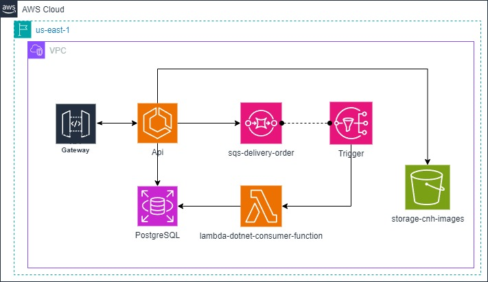
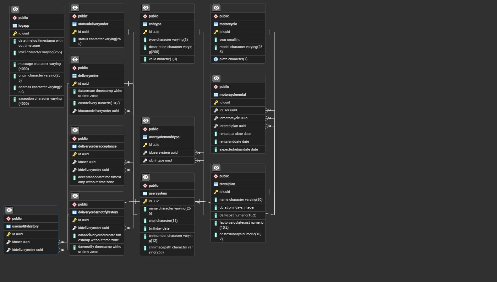
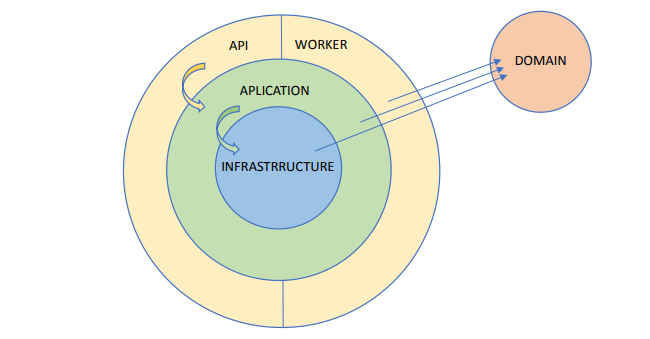

## Execução

### Pré-requisitos
- Docker
- AWS CLI

### 1 - Execução com Docker

1. Inicie o Docker.
2. Na pasta raiz do repositório, execute `docker-compose up`.
3. Aguarde até que os containers sejam baixados e iniciados.

### Configuração da AWS CLI

1. Após a instância estar em execução, configure a AWS CLI no terminal com `aws configure`.
2. Insira os seguintes valores:
   - Access Key ID: 123
   - Secret Access Key: 123
   - Default region name: us-east-1
   - Default output format: json

### Configuração e Implantação AWS

1. Execute o script `script_stack_aws.sh`.
   - Ele criará um bucket S3, uma fila SQS, um tópico SNS e configurará uma função Lambda.
   - Implantará a função Lambda compactada no arquivo `function.zip`.
   - Criará um trigger para a fila SQS, acionando a função Lambda quando mensagens forem consumidas.

### Teste da API

1. Acesse a API via Swagger em `http://localhost:8080/swagger/index.html`.
2. Utilize ferramentas como Postman ou Insomnia para testar a API.

## 2 - Execução em Ambiente Local

### Pré-requisitos
- Visual Studio 2022
- pgAdmin 4

### Instalações Necessárias
- SDK .NET 8
- AWS CLI
- Amazon.Lambda.TestTool-8.0

### Configuração do Banco de Dados PostgreSQL

1. Abra o pgAdmin 4 e insira a senha "inicial".
2. Crie uma base de dados chamada "postgresql".
3. Use a seguinte connection string:

```
User ID=postgres;Password=inicial;Host=localhost;Port=5432;Database=postgresql;Pooling=true;Connection Lifetime=0;
```

4. Execute o script `./config/setup.sql` na base de dados "postgresql".

### Configuração e Execução da API e Lambda

1. Altere a connection string no código para `Host=localhost` e os endereços dos serviços LocalStack para `localhost`.
2. Execute o script `script_stack_aws.sh` para configurar os serviços AWS localmente.
3. Execute a API e a função Lambda.

Certifique-se de seguir os passos corretamente e de que todas as dependências estejam instaladas para garantir o funcionamento adequado da aplicação.

---

## Arquitetura

### Arquitetura AWS Sugerida

O arquivo "Arquitetura.jpg" foi criado usando o draw.io, apresentando uma sugestão de arquitetura para a implementação desta solução.



### Modelagem de dados

A modelagem de dados visou normalizar as tabelas e seguir os melhores padrões



### Arquitetura AWS

As camadas da API foram pensadas usando o princípio da responsabilidade única tendo a camada "Data" responsável por todo tipo de integração com dados externos, a camada "Bussiness" responsável por todas as regras de negócio, a camada "Api" responsavél pela comunicação com o cliente e a camada "Core" responsável por todas as models e interfaces do projeto



---